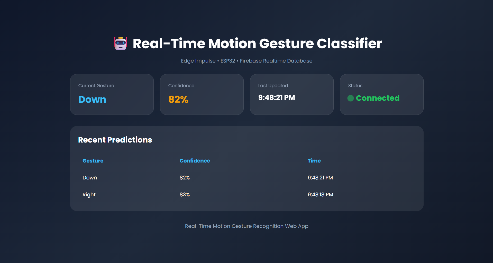

# Edge IoT Motion Gesture Recognition

A real-time motion gesture recognition project built using **ESP32**, **MPU6050 Accelerometer**, **Edge Impulse**, and a **Firebase-hosted web application**. The system captures motion data from an accelerometer, performs on-device machine learning inference, and displays gesture predictions through a web dashboard.

---

## Overview

This project demonstrates how TinyML can be integrated with embedded systems to perform real-time gesture recognition. Motion data collected from the MPU6050 sensor is processed using an Edge Impulse machine learning model running on the ESP32. A responsive web interface is included to visualize gesture predictions.

---

## Features

- Real-time motion gesture recognition
- ESP32 embedded implementation
- MPU6050 accelerometer integration
- Edge Impulse machine learning model
- Firebase-hosted web interface
- Live dashboard showing:
  - Current gesture
  - Prediction confidence
  - Last updated time
  - Connection status
  - Recent prediction history

---

## Technologies Used

- ESP32
- MPU6050 Accelerometer
- Edge Impulse
- PlatformIO
- Arduino Framework
- Firebase Hosting
- HTML
- CSS
- JavaScript
- Visual Studio Code

---

## Hardware Requirements

- ESP32 Development Board
- MPU6050 Accelerometer
- USB Cable

---

## Project Structure

```
edge-iot-motion-gesture/
│
├── Motion_Gesture_AI/
│   └── ESP32 firmware and Edge Impulse model
│
├── Motion_Gesture_WebApp/
│   └── Firebase-hosted web application
│
├── images/
│   └── dashboard.png
│
├── docs/
│
└── README.md
```

---

## Workflow

1. Read motion data from the MPU6050 sensor.
2. Preprocess the sensor values.
3. Run inference using the Edge Impulse model.
4. Classify the performed gesture.
5. Display the prediction on the web dashboard.

---

## Web Application

The project includes a responsive web dashboard that displays motion gesture predictions in real time.

### Live Demo

https://edge-iot-motion-gesture.web.app/

---

## Screenshot



---

## Repository

GitHub Repository:

https://github.com/Abhix47/edge-iot-motion-gesture

---

## Author

**Abhijith Sathyan**

Artificial Intelligence & Machine Learning Student

Government Engineering College Internship Assignment